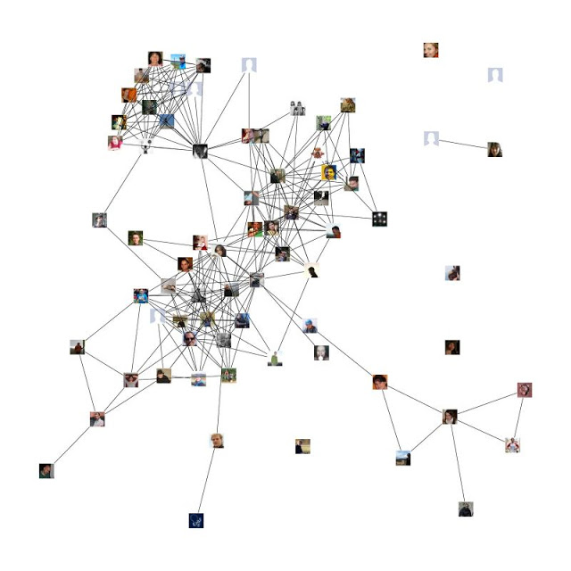
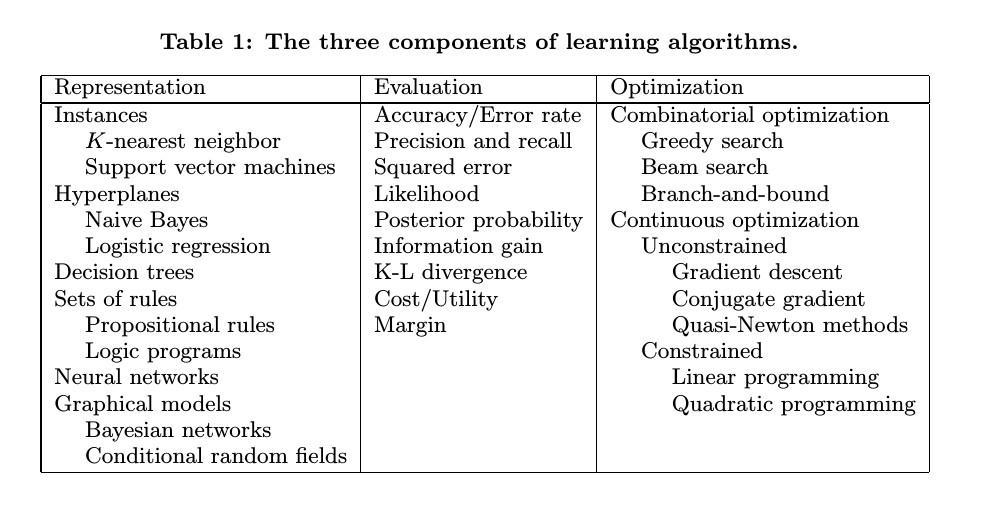
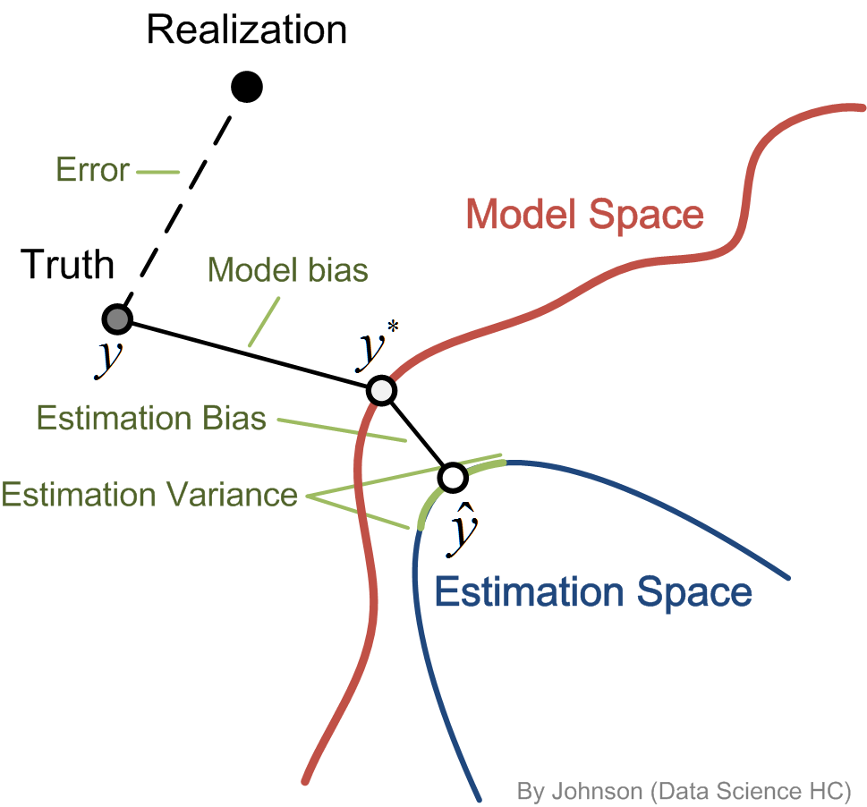
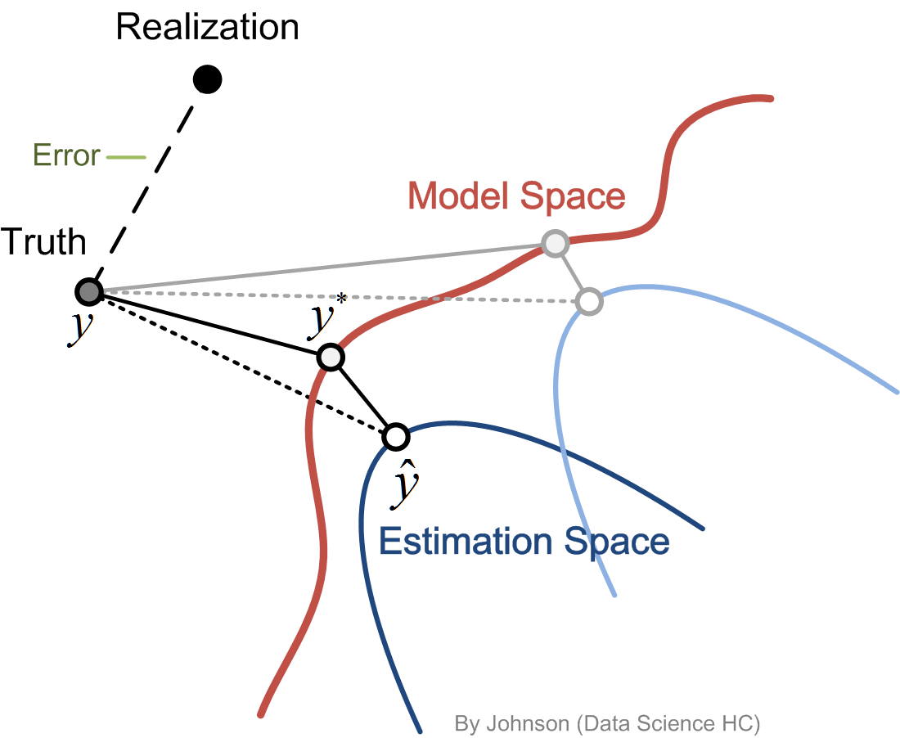

-----

-----

## Outline

- Define a statistical problem
    - Inference and prediction
    - Supervised versus Unsupervised learning    
    - What is "Learning" ?
- What actually are we (statistian/data scientist) doing ?
    - What we can do and what we cannnot ?    
    - No free lunch
    - Bias-Variance tradeoff
   
## Define a statistical problem
### Advertising data

```{r echo=FALSE, comment=""}
setwd("/home/ljta/Dropbox/DSG/ILSR/Ch2")
library(data.table)
dat.adv <- read.csv("Advertising.csv", header=TRUE); 
data.table(dat.adv[, -1])
```

Advertising budgets of <span style="color:blue">TV</span>, <span style="color:blue">radio</span>, and <span style="color:blue">newspaper</span> on a specific product along with its <span style="color:red">sale</span> on `r nrow(dat.adv)` markets. 


Request from our boss is always simple
<p style='text-align: center;'> '_Earn me more money_' </p>


## Define a statistical problem


<p style='text-align: center;'> '_Earn me more money_' </p>


```{r echo=FALSE}
par(mfrow=c(1,3))
attach(dat.adv)
plot(TV, Sales, pch=19) 
abline(a=coef(lm(Sales ~ TV))[1], b=coef(lm(Sales ~ TV, data=dat.adv))[2], col=2, lwd=3)
plot(Radio, Sales, pch=19)
abline(a=coef(lm(Sales ~ Radio))[1], b=coef(lm(Sales ~ Radio, data=dat.adv))[2], col=2, lwd=3)
plot(Newspaper, Sales, pch=19)
abline(a=coef(lm(Sales ~ Newspaper))[1], b=coef(lm(Sales ~ Newspaper, data=dat.adv))[2], col=2, lwd=3)
detach(dat.adv)
```


## Define a statistical problem
To increase the Sales, we need to understand


1.  The relationship between <span style="color:red">Sales</span> and <span style="color:blue">TV</span>/<span style="color:blue">Radio</span>/<span style="color:blue">Newspaper</span> ( **reference** problem )
2.  How much should I invest on each category to maximize the <span style="color:red">Sales</span> ? ( **prediction** problem )


$$ \boldsymbol{y} = f(\boldsymbol{X}) + \boldsymbol{\epsilon} $$

- Both of them behave in a similar way: 

<br>
<center> from an input to an ouput </center>
<br>

- CS guys called it __supervised learning__ because the response (Sales) can help us to supervise our analysis. On the other hand, they called __unsupervised learning__ if there is no response in the analysis.

## Define a statistical problem
**Unsupervised learning**: [friends in facebook](http://applyr.blogspot.tw/2012/01/mining-facebook-data-most-liked-status.html)





## What is Learning ?





-- [Pedro Domingos](http://homes.cs.washington.edu/~pedrod/papers/cacm12.pdf)

## What actually are we doing ?
$$ \boldsymbol{y} = f(\boldsymbol{X}) + \boldsymbol{\epsilon} $$

- In inference problem:
    - We care about both prediction **performance** and model **interpretability**. 
    - Staitstician tends to find an elegent (simple and useful) model $f$.
    - Linear model, Logistic regression, Cox-PH model, ...etc.
- In prediction problem:
    - We focus on the performance of **prediction**, care less about the structure of $f$.
    - Data scientist tends to find a complicated (in the sense of interpretability) $f$.
    - e.g.: SVM, decision tree, neural network, ... etc.


Before we get into it, a fundamental problem should be considered


Can we use any $f$ ?


## No free lunch
> When averaged over all possible problems, no algorithm will perform better than all others. -- No free lunch theory

> No algorithm is better than all others, and you need to use as much problem-specific knowledge as possible. -- No free lunch theory 

> No learner can can beat random guessing over all possible functions to be learned. -- No free lunch theory


- Fortunately, the real world problem always has physical phenomenon that we can learn from sampled data. 
- In fact, we only make general assumptions such as **smoothness**, **limited dependences**, **limited complexity**,  ... etc and it does well in practice.


-- [Pedro Domingos](http://homes.cs.washington.edu/~pedrod/papers/cacm12.pdf)


## What actually are we doing




-- [ESL](http://web.stanford.edu/~hastie/Papers/ESLII.pdf)    
    

## What actually are we doing




## What are we going to do ?


$$y = f(X) + \epsilon$$


- Unsupervised learning
    - Classification (Ch4)    
    - Unsupervised Learning (Ch10)
- Supervised learning (Inference purpose)
    - Linear regression (Ch3)
    - Resampling method (Ch5)
    - Linear model selection and regularization (Ch6)
    - Moving beyond linearity (Ch7)
- Supervised learning (Prediction purpose)
    - Tree based method (Ch8)
    - Support Vector Machine (Ch9)    


