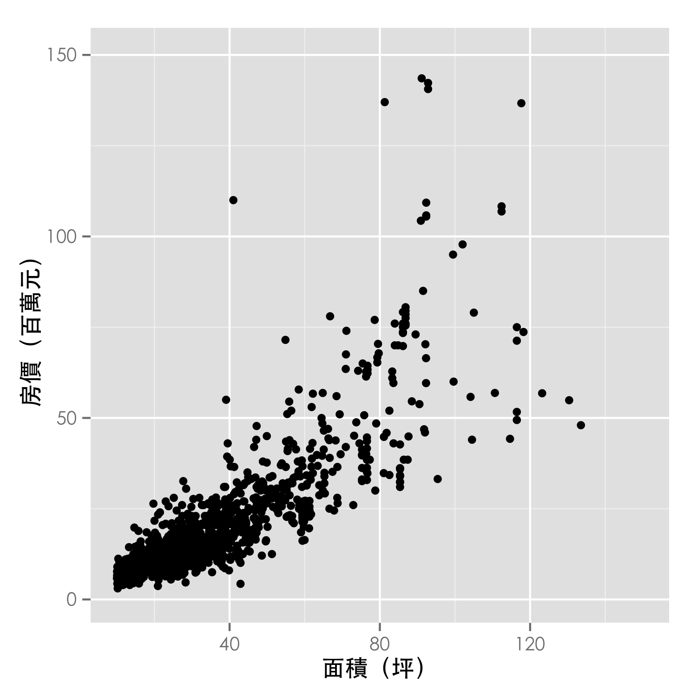
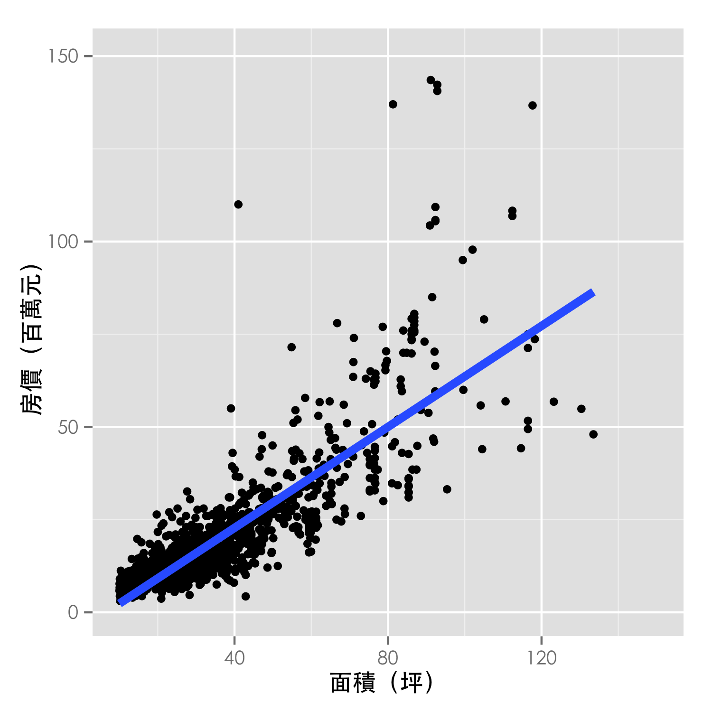
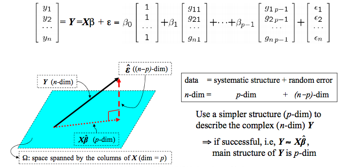

## Outline

- Introduction to linear regression  
    - Model definition
    - Least Square Estimator and its property 
    - Evaluation of our model: R-squared  
    - Interaction: Simpson's paradox,  Hierarchical principal  
- Trouble shooting  
    - Non linearity  
    - Correlation of error terms  
    - Non-constant variance of error terms  
    - Outliers and Leverage  
    - Collinearity 

##   
</img>

##   
</img>


## Model definition

Linear regression is a statistical tool assumes that the dependence of $y$ is linear on  $\boldsymbol{X}_1, \boldsymbol{X}_2, ..., \boldsymbol{X}_p$.
$$
\boldsymbol{Y} = \beta_0 + \beta_1\boldsymbol{X_1} + \beta_2\boldsymbol{X_2} + \epsilon 
\text{ } \rightarrow  \text{ } 
\boldsymbol{Y} = \boldsymbol{X}\boldsymbol{\beta} + \boldsymbol{\epsilon}
$$

- When to use linear regression?
    * causal relationship
    * association
- Why develop the fitted line?
    * description ($\hat{\beta}$)
    * prediction  ($\hat{y}$)

## Ordinary Least Square Estimator 

How to find the best fitted line?


[ref](http://chemwiki.ucdavis.edu/Analytical_Chemistry/Analytical_Chemistry_2.0/05_Standardizing_Analytical_Methods/5D%3A_Linear_Regression_and_Calibration_Curves)

## Ordinary Least Square Estimator


$$\hat{\boldsymbol{\beta}} = arg{min{\sum{(y_i - \hat{y_i})^2}}}$$


## Ordinary Least Square Estimator

Geometric interpretation  
</img><br>
$$
\boldsymbol{X\hat{\beta}} = \boldsymbol{X(X^TX)^{-1}X^TY}
$$

## Maximum Likelihood Estimator

- How to get MLE 
- Assumptions we need in MLE, that is $\boldsymbol{\epsilon} \sim N(\boldsymbol{0},\sigma^2\boldsymbol{I})$
- Consistency and most efficiency

## Best Linear Unbiased Estimator

### Gauss-Markov theorem:    
Let $\boldsymbol{\beta}$ as the OLS estimator.  
If $E(\epsilon) = \boldsymbol{0}$ and $Var(\epsilon)=\sigma^2\boldsymbol{I}$, then $\boldsymbol{\beta}$ is BLUE.

- BLUE [ref](http://en.wikipedia.org/wiki/Gauss%E2%80%93Markov_theorem)

## R-squared

### goodness-of-fit: how well does the model fit the data?    
- R-squared = Explained variation / Total variation    
- R-squared is always between 0 and 100%:    
- R-squared is the proportion of variance explained by our model  
$$
R^2 = \frac{\sum{(y_i - \hat{y}_i)^2}}{\sum{(y_i - \bar{y})^2}}
$$

## Remark

- More covariate leads to higher R-square
- Would be large for model without intercept  [ref](http://www.ats.ucla.edu/stat/mult_pkg/faq/general/noconstant.htm)    
- Cannot determine whether the coefficient estimates and predictions are biased    
- Canont detecte nonlinearity [ref](http://blog.minitab.com/blog/adventures-in-statistics/regression-analysis-how-do-i-interpret-r-squared-and-assess-the-goodness-of-fit)    

## Interaction

- Simpson's paradox [ref](http://vudlab.com/simpsons/)
- Interaction [ref](https://onlinecourses.science.psu.edu/stat501/node/74)
- Hierarchical principal (Why main effect should be included if the interaction is significant, see ISLR book)


## Nonlinearity  
</img>

## Nonlinearity
### Solutions
- Polynomial regression [ref](http://en.wikipedia.org/wiki/Polynomial_regression)  
- Local regression [ref](http://en.wikipedia.org/wiki/Local_regression)
- Kernel smoother [ref](http://en.wikipedia.org/wiki/Kernel_smoother)
- Smoothing spline [ref](http://en.wikipedia.org/wiki/Smoothing_spline)

## Bone Mineral Density
美國青少年脊柱骨質密度相對成長資料<br>
資料來源：Bachrach et al. (1999)
```{r cache=TRUE}
library(ElemStatLearn)
data(bone) # BMD of 261 north american adolescents
bone[sample(nrow(bone), 8),]
```

## Bone Mineral Density
美國青少年脊柱骨質密度相對成長資料<br>
觀察年齡與骨質密度相對成長之散佈圖
```{r cache=TRUE, echo=FALSE}
par(mar=c(4,4,1,1), cex.lab=1.3, cex.axis=1.3)
plot(spnbmd ~ age, data=bone, xlab="Age", ylab="Relative Change in BMD")
```

## Bone Mineral Density
美國青少年脊柱骨質密度相對成長資料<br>
觀察年齡與骨質密度相對成長之散佈圖
```{r cache=TRUE, echo=FALSE}
par(mar=c(4,4,1,1), cex.lab=1.3, cex.axis=1.3)
plot(spnbmd ~ age, data=bone, xlab="Age", ylab="Relative Change in BMD")
abline(lm(spnbmd ~ age, data=bone), lwd=2)
```

## Bone Mineral Density
美國青少年脊柱骨質密度相對成長資料<br>
以性別分組，觀察年齡與骨質密度相對成長之散佈圖
```{r cache=TRUE, echo=FALSE}
par(mar=c(4,4,1,1), cex.lab=1.3, cex.axis=1.3)
plot(spnbmd ~ age, data=bone, col = ifelse(gender=="male", 4, 2), 
     xlab="Age", ylab="Relative Change in BMD")
legend("topright", c("Male", "Female"), col=c(4, 2), pch=1, bty="n", cex=1.2)
```

## Bone Mineral Density
美國青少年脊柱骨質密度相對成長資料<br>
利用平滑曲線法 (smooth splines) 觀察不同性別之趨勢
```{r cache=TRUE, echo=FALSE, eval=TRUE}
par(mar=c(4,4,1,1), cex.lab=1.3, cex.axis=1.3)
sp.male <- with(subset(bone,gender=="male"), smooth.spline(age, spnbmd, df=12))
sp.female <- with(subset(bone, gender=="female"), smooth.spline(age, spnbmd, df=12))
col <- adjustcolor(c(4, 2), 0.5)
plot(spnbmd ~ age, data=bone, col = ifelse(gender=="male", col[1], col[2]), 
     xlab="Age", ylab="Relative Change in BMD")
lines(sp.male, col=4, lwd=5)
lines(sp.female, col=2, lwd=5)
legend("topright", c("Male", "Female"), col=c(4, 2), lwd=2, bty="n", cex=1.2)
```

## Bone Mineral Density
```{r cache=TRUE, echo=TRUE, eval=FALSE}
# 骨質密度成長率 vs 年齡
plot(spnbmd ~ age, data=bone, xlab="Age", ylab="Relative Change in BMD")
abline(lm(spnbmd ~ age, data=bone), lwd=2)

# 以性別分層
plot(spnbmd ~ age, data=bone, col = ifelse(gender=="male", 4, 2), 
     xlab="Age", ylab="Relative Change in BMD")
legend("topright", c("male", "Female"), col=c(4, 2), 
       pch=1, bty="n", cex=1.2)
```

## Bone Mineral Density
```{r cache=TRUE, echo=TRUE, eval=FALSE}
# 平滑曲線分析
sp.male <- with(subset(bone,gender=="male"), 
                smooth.spline(age, spnbmd, df=12))
sp.female <- with(subset(bone, gender=="female"), 
                  smooth.spline(age, spnbmd, df=12))
plot(spnbmd ~ age, data=bone, col = ifelse(gender=="male", 4, 2), 
     xlab="Age", ylab="Relative Change in BMD", pch=1)
lines(sp.male, col=4, lwd=5)
lines(sp.female, col=2, lwd=5)
legend("topright", legend=c("male", "Female"), col=c(4, 2), 
       lwd=2, bty="n", cex=1.2)
```

## Important issue
- Non-constant variance of error terms  
- Time depedent data
- Outliers and leverage
- Normality of variance

## Residual Analysis
- Residual vs. Independent 
    + Checking the error variance
    + Improving the regression model
- Residual vs. Predicted Value
- Residual vs. Order of the Data 
    + Checking the error variance, drift
    + Time series
- Residual Lag Plot (Checking independence of the error term)
- Histogram of the Residual (Checking normality of variance)
- Normal Probability Plot of Residuals (Checking normality of variance)
[ref](http://www.originlab.com/doc/Origin-Help/Residual-Plot-Analysis)


## Collinearity  
### See Ch6 regularization

## What are we going to do ?

$$
y = f(X) + \epsilon
$$  

- Supervised learning (Inference purpose)
    - Linear regression (Ch3)  
    - Classification (Ch4)  
    - Resampling method (Ch5)  
    - Linear model selection and regularization (Ch6)  
    - Moving beyond linearity (Ch7)  
- Supervised learning (Prediction purpose)  
    - Tree based method (Ch8)  
    - Support Vector Machine (Ch9)      
- Unsupervised learning  
    - Unsupervised Learning (Ch10)  


