## Outline

- Logistic Regression
    - Logit function
    - Relative Risk vs. Odds Ratio    
    - Separation problem and bias reduction GLM
    - Multinomial case
- Linear Discriminant Analysis (LDA)
    - a Bayesian perspective
    - Comparisons
- Receiver Operating Characteristic (ROC) curve
    - Confusion matrix and Hypothesis testing
    - ROC space
    - Algorithm of ROC curve
    - Area Under the Curve (AUC) and its relationship to Wilcoxon rank-sum test
   

## Defaulted data

A simulated data set containing information on ten thousand customers. The aim here is to predict which customers will default on their credit card debt.

```{r echo=FALSE, comment=""}
library(data.table); library(ISLR); data(Default)
data.table(Default)
```

Now, the response of interest becomes
$$
\begin{align*}
Y = \left\{\begin{array}{ll}
1 & \text{ if deafult: Yes} \\
0 & \text{ if deafult: No} \\
\end{array}\right.
\end{align*}
$$
and we tend to model
$$
\text{Pr}(\text{default}=\text{Yes}|\text{student, balance, income})
$$


## Logit function
Suppose now we are going to use balance only to predict default, and keep using linear regression with this 0-1 coding.
$$
p(\boldsymbol{X}) = \beta_0 + \beta_1\boldsymbol{X}
$$
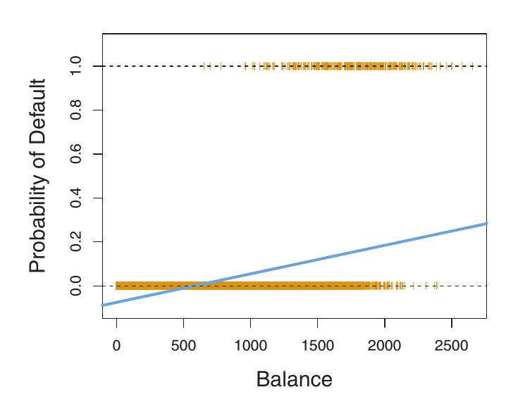

- the range of predicted value: $(-\infty, \infty)$ 
- Fitting a line across the centroid of data may not be a good idea in binary case.

## Logit function
A more reasonable choice is the **logit** or **log-odds** function
$$f(x) = \frac{e^{x}}{1+e^{x}}$$
```{r echo=FALSE, comment=""}
curve(exp(x)/(1+exp(x)), xlim=c(-10, 10), ylim=c(0,1), ylab="f(x)", lwd=3)
abline(h=0.5, lty=2, col=2)
abline(v=0, lty=2, col=1)
```

## Logit function
$$
p(\boldsymbol{X})=\frac{e^{\beta_0+\beta_1\boldsymbol{X}}}{1+e^{\beta_0+\beta_1\boldsymbol{X}}}
$$

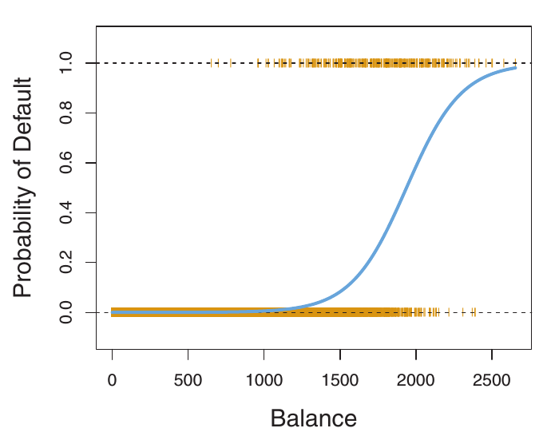

## Logit function

$$
p(\boldsymbol{X})=\frac{e^{\beta_0+\beta_1\boldsymbol{X}}}{1+e^{\beta_0+\beta_1\boldsymbol{X}}} ~~~ \text{ or } ~~~ \log\left(\frac{p(\boldsymbol{X})}{1-p(\boldsymbol{X})}\right) = \beta_0+\beta_1\boldsymbol{X}
$$
Consider the case $\boldsymbol{X}=x_1$ and $\boldsymbol{X}=x_2$
$$
\begin{align*}
\log\left(\frac{p(x_1)}{1-p(x_1)}\right) =& \beta_0+\beta_1 x_1 \\
\log\left(\frac{p(x_2)}{1-p(x_2)}\right) =& \beta_0+\beta_1 x_2 \\
\beta_1(x_2-x_1) =& \log\left(\frac{\text{odd}(x_2)}{\text{odd}(x_1)}\right)
\end{align*}
$$


- coefficient of logistic regression can be interpreted as: "with the increasement of $x$,  the expected change of **log(odds)** ."
- Odd is not probability, and it comes with a non-intuitive interpretation.
- Why statistician use logit function here ? One rationale is the invariance property of logit function.


## Relative Risk and Odds Ratio   


$$ \text{RR} = \frac{p_1}{p_2} = \frac{a}{(a+b)}/\frac{c}{(c+d)} $$   
$$ \text{OR} = \frac{p_1/1-p_1}{p_2/1-p_2} = \frac{a}{b}/\frac{c}{d} $$   


## Relative Risk and Odds Ratio 
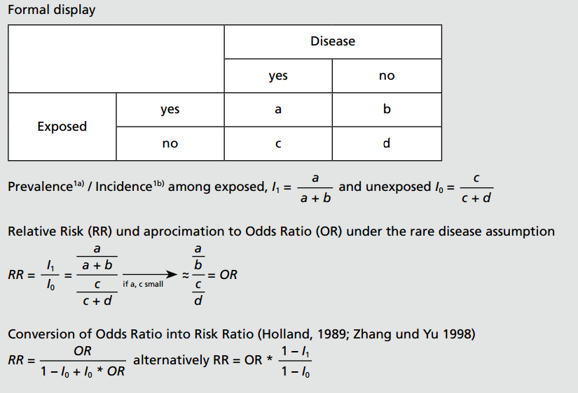

[Carsten Oliver Schmidt, Thomas Kohlmann](http://link.springer.com/article/10.1007%2Fs00038-008-7068-3#page-1)


## Invariance property of OR


$$ \text{RR} = \frac{p_1}{p_2} = \frac{a}{(a+b)}/\frac{c}{(c+d)} $$   
$$ \text{OR} = \frac{p_1/(1-p_1)}{p_2/(1-p_2)} = \frac{a}{b}/\frac{c}{d} $$   

If we focus on non-disease group

$$ \text{RR'} = \frac{1-p_1}{1-p_2} = \frac{b}{(a+b)}/\frac{d}{(c+d)} \neq \frac{1}{\text{RR}}$$   
$$ \text{OR'} = \frac{(1-p_1)/p_1}{(1-p_2)/p_2} = \frac{b}{a}/\frac{d}{c} = \frac{1}{\text{OR}} $$   


## Maximum Likelihood Estimation
Consider $y_i$ follows i.i.d. Bernoulli($p(x_i;\boldsymbol{\beta})$)
$$
\begin{align*}
L(\boldsymbol{\beta}) =& \prod_{i=1}^n p(x_i;\boldsymbol{\beta})^{y_i}(1-p(\boldsymbol{x}_i;\boldsymbol{\beta}))^{1-y_i} \\
l(\boldsymbol{\beta}) =& \sum_{i=1}^n \{y_i\boldsymbol{\beta}^T\boldsymbol{x}_i -\log(1+e^{\boldsymbol{\beta}^T\boldsymbol{x}_i}) \}\\
\frac{\partial l(\boldsymbol{\beta})}{\partial\boldsymbol{\beta}} =&
\sum_{i=1}^n\boldsymbol{x}_i^T(y_i-p(\boldsymbol{x}_i;\boldsymbol{\beta}))=0\\
\frac{\partial^2 l(\boldsymbol{\beta})}{\partial\boldsymbol{\beta}\partial\boldsymbol{\beta}^T} =& -\sum_{i=1}^n\boldsymbol{x}_i\boldsymbol{x}_i^Tp(\boldsymbol{x}_i;\boldsymbol{\beta})(1-p(\boldsymbol{x}_i;\boldsymbol{\beta}))\\
\boldsymbol{\beta}^{\text{new}} =& \boldsymbol{\beta}^{\text{old}} +
\left(\frac{\partial^2 l(\boldsymbol{\beta})}{\partial\boldsymbol{\beta}\partial\boldsymbol{\beta}^T}\right)^{-1} \frac{\partial l(\boldsymbol{\beta})}{\partial\boldsymbol{\beta}}
\end{align*}
$$


## Separation problem
fit a standard logistic regression
```{r echo=FALSE, comment=""}
library(ISLR); data(Default)
mod <- glm(default~., family=binomial("logit"), data=Default)
summary(mod)
```

If I add an artificial covariate $Z$ where
$$
\begin{align*}
Z = \left\{\begin{array}{ll}
1 & \text{defualt = No} \\
0 & \text{defualt = Yes} \\
\end{array}\right.
\end{align*}
$$
   
```{r echo=FALSE, comment=""}
Z <- ifelse(Default$default=="No", 1, 0)
dat <- cbind(Default, Z)
mod <- glm(default~., family=binomial("logit"), data=dat)
summary(mod)
```
   
   
## Bias Reduction GLM
- Apparently, in the case of separation, the inverse of Hassien matrix exploded during iterations.
- One remedy is [bias reduction GLM](http://onlinelibrary.wiley.com/doi/10.1002/sim.1047/abstract;jsessionid=6645BC382E1F0B18D07F9ED3E4612E65.f02t03) which modified its score function to prevent the technical problem.

$$
\frac{\partial l(\boldsymbol{\beta})}{\partial\boldsymbol{\beta}} =
\sum_{i=1}^n\boldsymbol{x}_i^T(y_i-p(\boldsymbol{x}_i;\boldsymbol{\beta})+h_i(1/2+p(\boldsymbol{x}_i;\boldsymbol{\beta})))=0
$$
where $h_i's$ are the $i$ th element of hat matrix.

```{r echo=FALSE, comment=""}
Z <- ifelse(Default$default=="No", 1, 0)
dat <- cbind(Default, Z)
library(brglm)
mod <- brglm(default~., family=binomial("logit"), data=dat)
summary(mod)
```


## Multinomial case
Is it possible to generalize the logistic regression to a multiple category version ? (YES)

- Multinomial logit model
    - $Y=\{1,2,\dots,r\}$, r nominal categories
    $$\log(\frac{P(Y=j|\boldsymbol{X})}{P(Y=1|\boldsymbol{X})}) = \alpha_j + \boldsymbol{\beta}_j\boldsymbol{X} ~~~ , j=1,\dots,r$$
- Proportional Odds model
    - $Y=\{1,2,\dots,r\}$, r ordinal categories
    $$\log(\frac{P(Y\leq j|\boldsymbol{X})}{1-P(Y\leq j|\boldsymbol{X})}) = \alpha_j - \boldsymbol{\beta}^T\boldsymbol{X} ~~~ , j=1,\dots,r$$
   
   
## Linear Discriminant Analysis
- In logistic regression, we directly estimate $p(Y=1|\boldsymbol{X})$ by constructing an additive model.
- We can estimate it in another way: Bayesian perspective.
- Suppose now we are discussing $K$ groups, not only binary case, and only one covariate ($p=1$).
$$
\begin{align*}
P(Y=k|\boldsymbol{X}=\boldsymbol{x}) =& \frac{P(Y=k, \boldsymbol{X}=\boldsymbol{x})}{P(\boldsymbol{X}=\boldsymbol{x})}\\
=& \frac{P(\boldsymbol{X}=\boldsymbol{x}|Y=k)P(Y=k)}{\sum_{k=1}^KP(\boldsymbol{X}=\boldsymbol{x}|Y=k)P(Y=k)}
\end{align*}
$$

- Assume
    - $P(X=x|Y=k)\sim N(\mu_k,\sigma^2)$
    - $P(Y=k)=\pi_k$    
- Thus, for each $x$, we can predict its probability in each of $k$ groups. If we choose the highest predicted probability as where it belongs to, a classifier is then constructed. (Note: calssifier $\delta_k(x)$ is linear in $x$, that's why we call it LDA)
$$
\delta_k(x) = x\frac{\mu_k}{\sigma^2} - \frac{\mu_k^2}{2\sigma^2} + \log(\pi_k)
$$
- This theoretical classifier is named Bayesian Classifier and it cannot be obtained in real data. Parameters should be estimated
$$
\begin{align*}
\hat{\mu}_k =& \frac{1}{n_k}\sum_{i:y_i=k}x_i \\
\hat{\sigma}^2 =& \frac{1}{n-K}\sum_{k=1}^K\sum_{i:y_i=k}(x_i-\hat{\mu}_k)^2\\
\hat{\pi}_k =& \frac{n_k}{n}
\end{align*}
$$

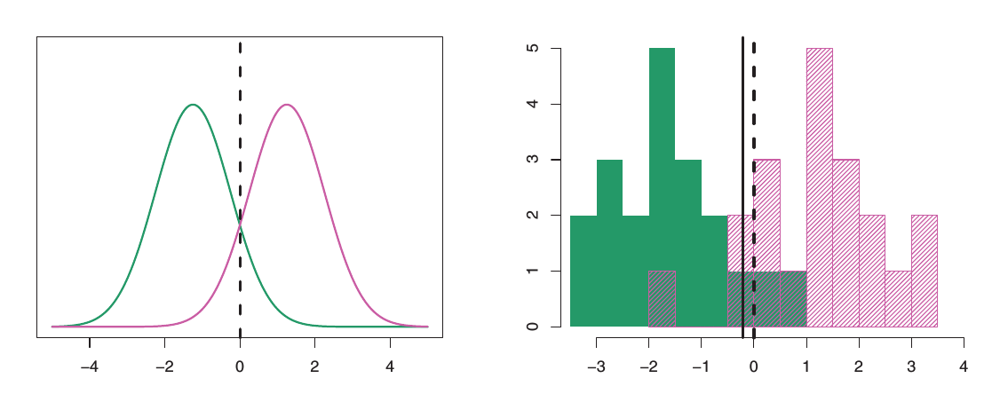

- The dashed line correpsonds to linear discriminant boundary, $\hat{\delta}_1(x)=\hat{\delta}_2(x)$
- In the view of boundary separation, and in the two-class case, this amount to assigning an observation to the $Y=1$ class if 
$$
\text{Pr}(Y=1|X=x)>0.5
$$
since 
$$
\sum_{k=1}^2\text{Pr}(Y=k|X=x)=1
$$


## Linear Discriminant Analysis (extension)

- Extention to $p>1$

$$
\delta_k(x) = x^T\Sigma^{-1}\mu_k - \frac{1}{2}\mu_k^T\Sigma^{-1}\mu_k + \log(\pi_k)
$$
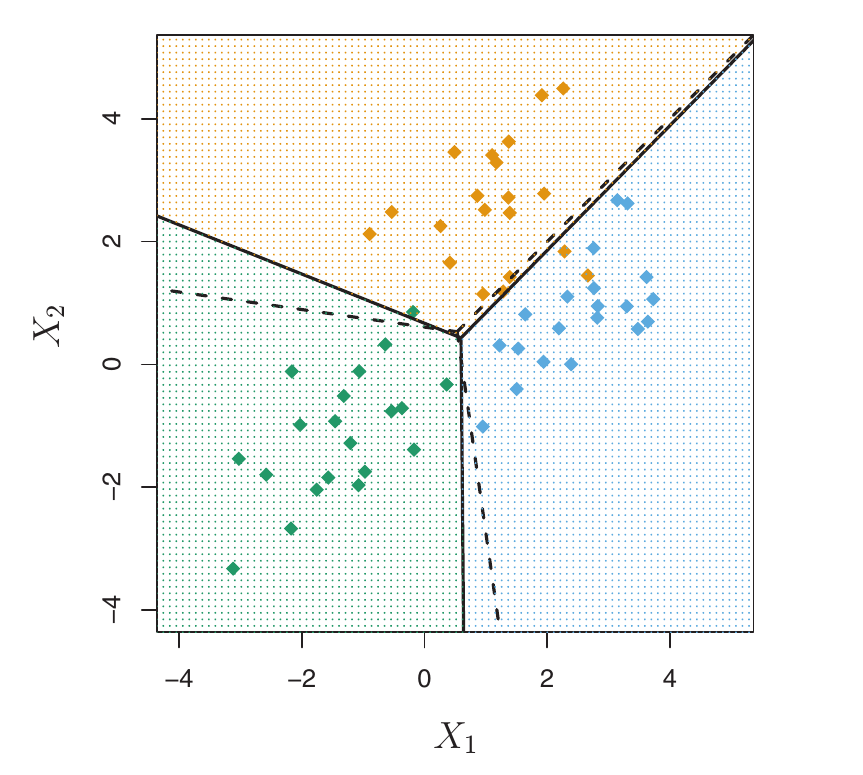


- These three boundary correspond to $\hat{\delta}_1=\hat{\delta}_2, \hat{\delta}_1=\hat{\delta}_3, \hat{\delta}_2=\hat{\delta}_3$
- Release the assumption $\Sigma_1=\Sigma_2=\cdots=\Sigma_K$: Quadratic Discriminate Analysis
$$
\delta_k(x) = -\frac{1}{2}x^T\Sigma_k^{-1}x + x^T\Sigma_k^{-1}\mu_k -\frac{1}{2}\mu_k^T\Sigma_k^{-1}\mu_k - \frac{1}{2}\log|\Sigma_k| + \log(\pi_k)
$$


## Comparison

- Regression type classifier has better interpretability, but its parameters is more difficult to estimate (separation problem).
- Logistic is not easy to extend multiple class case, i.e., more than binary.
- LDA/LQA is easier to extend to multiple class and it won't suffer from separation problem. However, it needs Normal assumtpion for each covariates. In other words, only continuous covariates can be applied.
- When $p$ is large, covariance matrix is uneasy to converge which make LDA/LQA unstable.


## Receiver Operation Characteristics

- Confusion Matrix

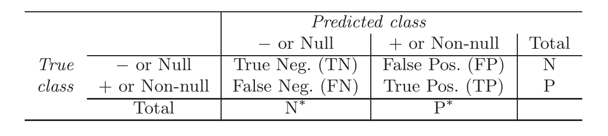

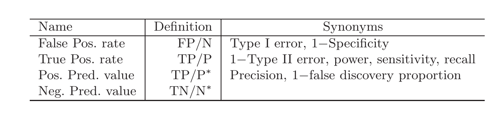

- Connect to hypothesis testing

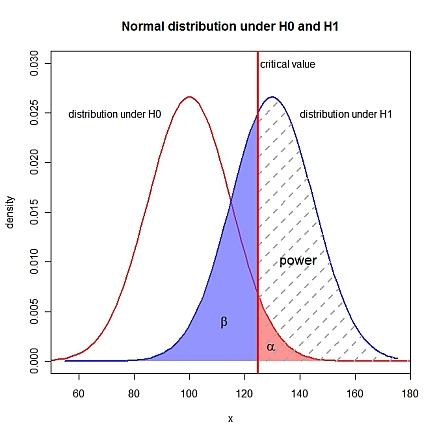

## Receiver Operation Characteristics

- ROC space [(Tom Fawcett)](http://www.sciencedirect.com/science/article/pii/S016786550500303X)

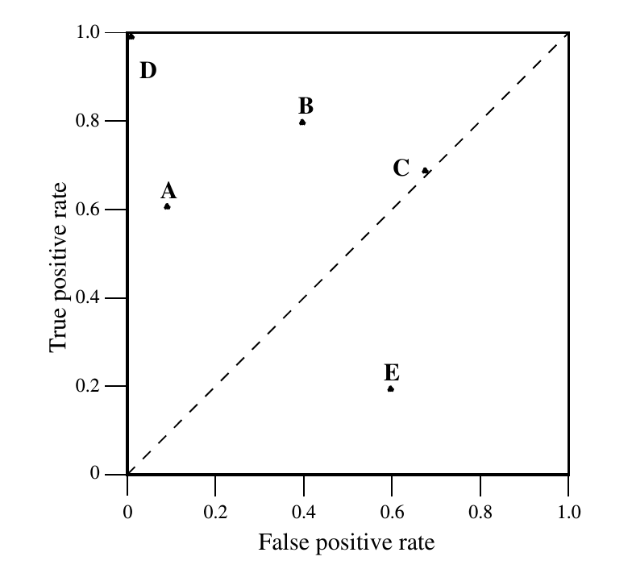

- 
    - $(0, 0)$: Guess all observation as Negative
    - $(1, 1)$: Guess all observation as Positive
    - $(0, 1)$: Perfect guessing, $D$
    - $C$: (points on the diagonal line) Equivalent to random guessing
    - $E$: (points below the diagonal line) poor than random guessing    
    - Classifiers appearing on the left-hand of an ROC graph, near the X-axis, may be thought of conservative: they make positive classifications only with strong evidence so they make few false positive errors, but they often have low true positive rates as well. Thus $A$ to $B$ can be read as "from conservative to liberal".

## Receiver Operation Characteristics

- Consider LDA, an observation be classified to class $Y=1$ if $P(Y=1|X=x)>0.5$. Under this criterion, $0.5$ is a threshold for a discrete classifier which produce a single point in ROC space.
- Conceptually, we may imagine varying a threshold from $-\infty$ to $\infty$ ($0$ to $1$ in LDA) and tracing a curve through ROC space.
- Monotonicity of thresholded classifications:
    - any instance that is classified positive with respect to a given threshold will be classified positive for all lower thresholds as well.
    - It lead to an efficient algorithm for producing ROC curve.

- Take LDA for example:

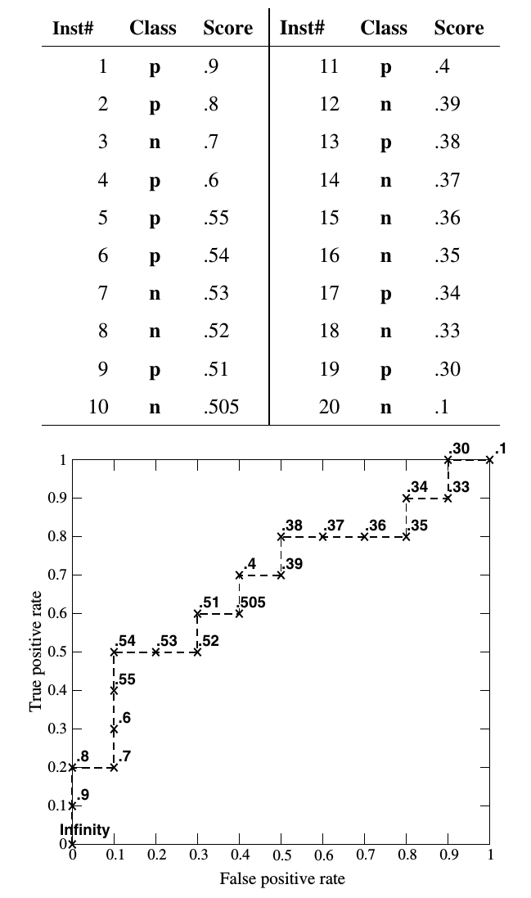


## Receiver Operation Characteristics

- Compare multiple ROC curves

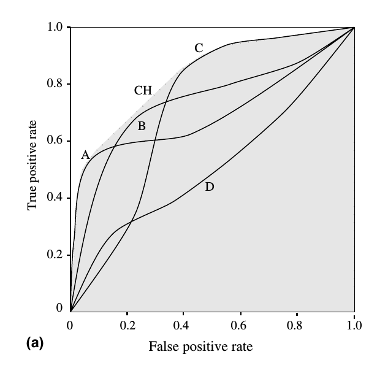

- Wilcoxon rank-sum test
    - Given a binary classifier $\delta(x)$, sort the $\hat{\delta}(x)$ in descreasing order. If $\delta(x)$ performs well, we expect to see
    $$T, H, H, H, H, H, T, T, T, T, T, H$$
    otherwise, if $\delta(x)$ performs poor, we perhaps see the following
    $$T, H, T, T, H, H, T, H, T, H, T, H$$
    - In the view of Wilcoxon test, it is equivalent to test if the rank-sum of $T$ is equal to the rank-sum of $H$, given $\delta{x}$

- Actually, AUC is equivalent to Wilcox rank-sum test [(Wiki)](http://en.wikipedia.org/wiki/Mann%E2%80%93Whitney_U_test#Area-under-curve_.28AUC.29_statistic_for_ROC_curves)
$$
AUC = \frac{U_1}{n_1n_2}
$$

- Interpretation
    - AUC of a classifier is equivalent to the probability that the classifier will rank a randomly chosen positive instance higher than a randomly chosen negative instance.

- Classifier $A$ and $C$, which one is better ?

## What are we going to do ?


$$y = f(X) + \epsilon$$


- Unsupervised learning    
    - Unsupervised Learning (Ch10)
- Supervised learning (Inference purpose)
    - Linear regression (Ch3)
    - Classification (Ch4)    
    - Resampling method (Ch5)
    - Linear model selection and regularization (Ch6)
    - Moving beyond linearity (Ch7)
- Supervised learning (Prediction purpose)
    - Tree based method (Ch8)
    - Support Vector Machine (Ch9)    


